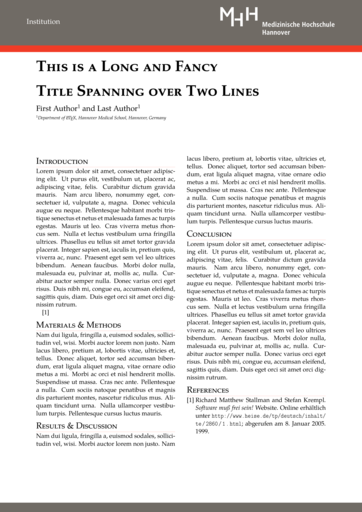

Unofficial MHH Poster Template
==============================
This LaTeX template for scientific posters is not supported and in no way endorsed by the [Hannover Medical School][MHH] (MHH). It is intended for personal use only.

Features
--------
+-------------------------------------+-------------------------------------+
| \\textmagnification{float}          | globaly scale the body textsize     |
+-------------------------------------+-------------------------------------+
| \\titlemagnification{float}         | scale the title textsize            |
+-------------------------------------+-------------------------------------+
| \\institutemagnification{float}     | scale the institutes textsize       |
+-------------------------------------+-------------------------------------+
| \\gradient{color1}{color2}{degrees} | draw a background gradient function |
+-------------------------------------+-------------------------------------+

The template uses the [authblk] package for author and affiliation management.

[MHH]: https://www.mh-hannover.de
[authblk]: https://www.ctan.org/pkg/authblk

